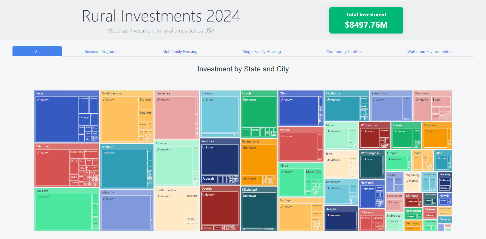

Rural Investments 2024 Dashboard
# Overview
The Rural Investments 2024 Dashboard is an interactive web application designed to visualize investment data in rural areas across the USA for the year 2024. This dashboard provides various interactive charts and filters to help users explore and analyze investment trends and distributions.



## Features
- Investment Overview: Displays the total investment amount in a card.
- State-wise Investment: Interactive chart showing investments by state.
- Program-wise Investment: Customizable chart displaying investment by program area or program name.

## Installation
### Prerequisites
Ensure you have Python 3.10 or above and pip installed

### Clone the Repository
```bash
git clone https://github.com/your-username/rural-investments-2024.git
cd rural-investments-2024
```

### Install Dependencies
Create a virtual environment (optional but recommended):
```bash
python -m venv venv
source venv/bin/activate  # On Windows, use `venv\Scripts\activate`
```
Install the required packages:
```bash
pip install -r requirements.txt
```

## Configuration
Update any configuration settings as needed in the app.py file or other configuration files.

## Usage
To start the application, run:
```bash
python app.py
```
Open your web browser and navigate to http://127.0.0.1:8050 to view the dashboard.

## Code Structure
- app.py: Main application file where the Dash app is defined and run.
- assets/: Contains CSS and JavaScript files for custom styling and functionality.
- data/: Directory where the dataset is stored (if applicable).
- requirements.txt: Lists the required Python packages.

## Contributing
Contributions are welcome! Please open an issue or submit a pull request for any improvements or bug fixes.
